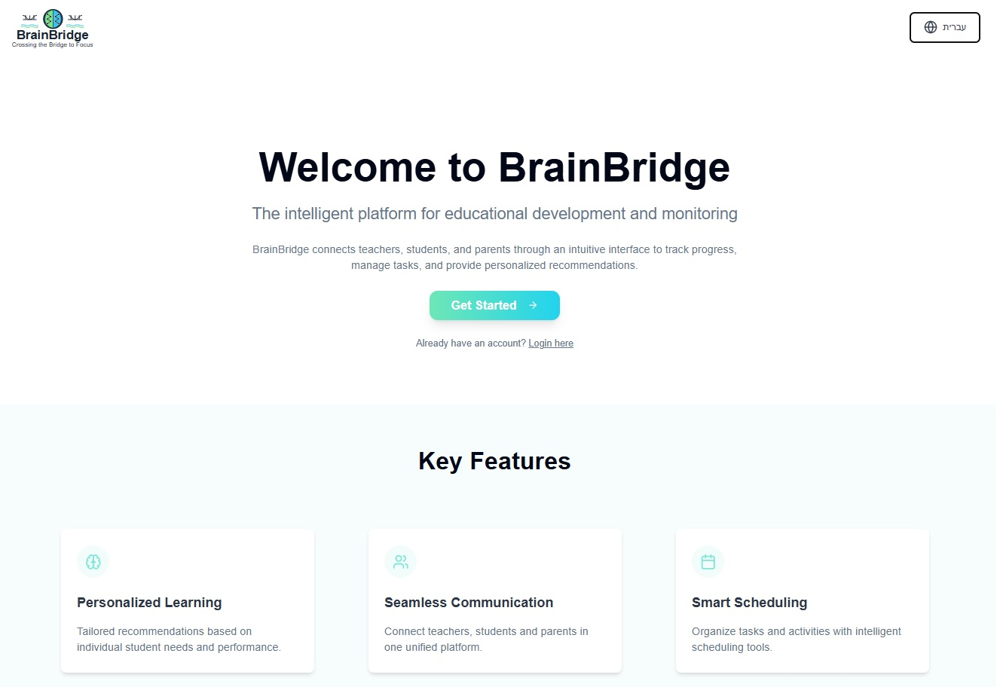

## 🔗 Live System
https://brain-bridge.net/

## 🔗 Repository / All Materials
https://github.com/nil-adar/BrainB

## Landing Page


## Project Description

This project is a platform designed to support individuals with ADHD. The system provides smart tools and features to assist users in managing their daily challenges and improving their quality of life.

### 🎥 Demo Video
[](https://youtu.be/3yylb_jKSqg)

Click the thumbnail above to watch a 2-minute walkthrough of BrainBridge in action.  

Key features include:

- Smart assessment based on external ADHD diagnosis (via Nodus)
- Learning and progress monitoring
- Personalized recommendations tailored to user needs
- Tools for daily focus, planning, and symptom management

Tech stack:
- Vite · React · TypeScript · Tailwind CSS

The platform combines a modern tech stack with accessibility and ease of use, aiming to offer effective support for people with ADHD in both educational and personal contexts.

## 📄 Project Artifacts
- **Poster (PDF):** [View](./final_poster.pdf) ·
- **Project Book – Part A (PDF):** [View](./project_book_Managing_Attention_Difficulties_phaseA.pdf) · 
- **Project Book – Part B (PDF):** [View](./Capstone_Project-PhaseB_BrainBridge.pdf) ·


## 🚀 How to Run the Project

### Step 1: Clone the repository
```bash
git clone https://github.com/nil-adar/BrainB.git
```

### Step 2: Navigate to the project directory
```bash
cd BrainB
```

### Step 3: Install dependencies
```bash
npm i
```

### Step 4: Run the development servers (open three terminals)
Open **three terminals**:

#### Terminal 1 – Frontend (Vite)
```bash
npm run dev
```

#### Terminal 2 – Backend (Node.js)
```bash
npm run server
```
API example: http://localhost:5000

#### Terminal 3 – NODUS (Django) 
Required only if you want to run the external diagnostic engine that creates an External Assessment to unlock recommendations.
```bash
cd Nodus
py -m venv .venv
.\.venv\Scripts\Activate.ps1
pip install -r requirements.txt
py manage.py migrate
py manage.py runserver 8000                                       # when done, to return
```
Backend ENV (example):
Create backend/.env (or your config) with:
```bash
NODUS_BASE_URL=http://localhost:8000/api   # or https://nodus.your-domain/api
NODUS_API_KEY=your-key-here                # if applicable
```
If you already have a hosted NODUS, you can skip Terminal 3 and just set NODUS_BASE_URL to the hosted URL.

💡 Ensure ts-node is available for backend dev:
```bash
npm install -g ts-node typescript
```

This setup allows you to:
- View the frontend at `http://localhost:8080`
- Have the backend API listening on your defined port (e.g., `5000`)
