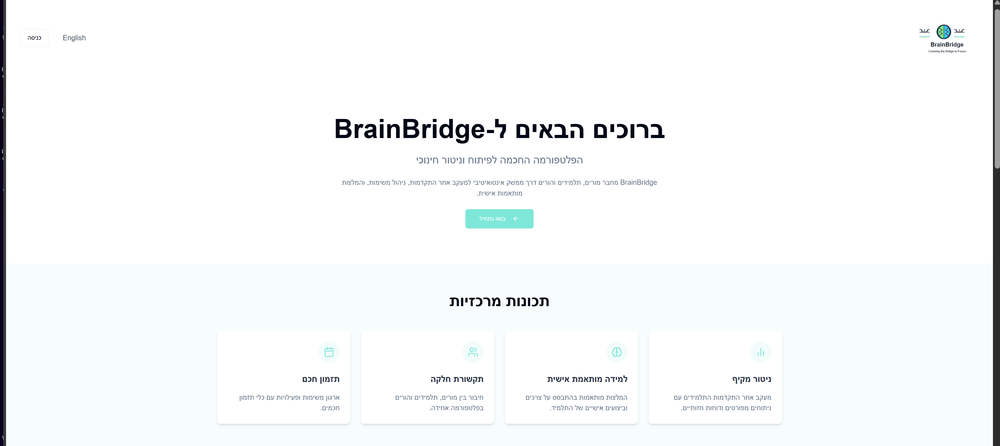

## 🔗 Live System
**Use BrainBridge online:**  
<a href="https://brain-bridge.net/" target="_blank"><strong>https://brain-bridge.net/</strong></a>

## Landing Page


## Project Description

This project is a platform designed to support individuals with ADHD. The system provides smart tools and features to assist users in managing their daily challenges and improving their quality of life.

### 🎥 Demo Video
[](https://youtu.be/3yylb_jKSqg)

Click the thumbnail above to watch a 2-minute walkthrough of BrainBridge in action.  

Key features include:

- Smart assessment based on external ADHD diagnosis (via Nodus)
- Learning and progress monitoring
- Personalized recommendations tailored to user needs
- Tools for daily focus, planning, and symptom management

The project is built using:

- Vite
- React
- TypeScript
- Tailwind CSS

The platform combines a modern tech stack with accessibility and ease of use, aiming to offer effective support for people with ADHD in both educational and personal contexts.

## 📄 Project Artifacts
- **Poster (PDF):** [View](final_poster.pdf)

- **Project Book – Part A (PDF):** [View](project_book_Managing_Attention_Difficulties_phaseA.pdf.pdf) ·

- **Project Book – Part B (PDF):** [View](Capstone_Project-PhaseB_BrainBridge.pdf.pdf) ·

## 🚀 How to Run the Project

### Step 1: Clone the repository
```bash
git clone 
```

### Step 2: Navigate to the project directory
```bash
cd BrainB
```

### Step 3: Install dependencies
```bash
npm i
```

### Step 4: Run the development servers
Open **two terminals**:

#### Terminal 1 – Frontend (Vite)
```bash
npm run dev
```

#### Terminal 2 – Backend (Node.js)
```bash
npm run server
```

This setup allows you to:
- View the frontend at `http://localhost:8080`
- Have the backend API listening on your defined port (e.g., `5000`)

---

💡 Make sure you have `ts-node` installed and configured properly for the backend to work. If needed, install it globally:
```bash
npm install -g ts-node typescript
```


- Vite
- TypeScript
- React
- shadcn-ui
- Tailwind CSS
