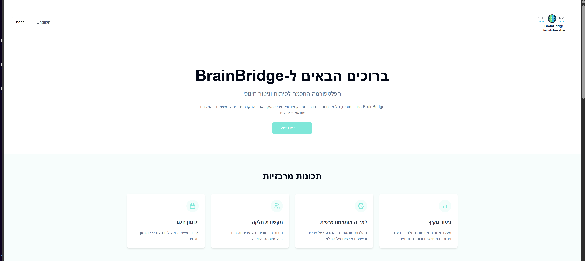

## Project Description

This project is a platform designed to support individuals with ADHD. The system provides smart tools and features to assist users in managing their daily challenges and improving their quality of life.

Key features include:

- Smart assessment based on external ADHD diagnosis (via Nodus)
- Learning and progress monitoring
- Personalized recommendations tailored to user needs
- Tools for daily focus, planning, and symptom management

The project is built using:

- Vite
- React
- TypeScript
- Tailwind CSS

The platform combines a modern tech stack with accessibility and ease of use, aiming to offer effective support for people with ADHD in both educational and personal contexts.


how to run the project 
# Step 1: Clone the repository using the project's Git URL.
git clone <YOUR_GIT_URL>

# Step 2: Navigate to the project directory.
cd <YOUR_PROJECT_NAME>

# Step 3: Install the necessary dependencies.
npm i

# Step 4: Start the development server with auto-reloading and an instant preview.
npm run dev
```

Landing page




- Vite
- TypeScript
- React
- shadcn-ui
- Tailwind CSS
